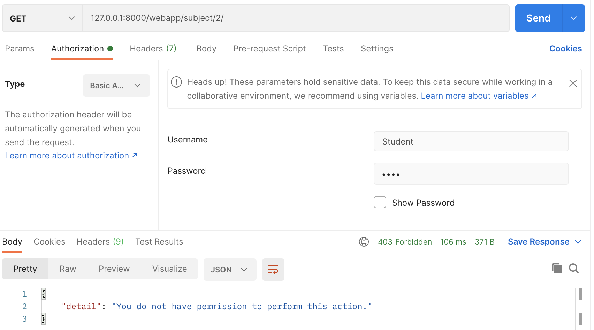

https://forum.wordreference.com/threads/subject-vs-course.1556086/post-7841826

## Assumptions
* A Subject is parent of course. For eg a subject can be English and course
can be "Shakespeare", "Essay Writing", etc.

## Steps to run

### Authorized users
* Student: Student/stud
* Instructor: Instructor/inst

## REST API

### Subject

#### Create Subject
POST /webapp/subject/

#### Get Subject
GET /webapp/subject/<id>//

#### Delete Subject
DELETE /webapp/subject/<id>/

#### Update Subject
PATCH /webapp/subject/<id>/

#### Student Access

### Course

#### Create Course
POST /webapp/subject/<id>/course/

#### Get Course
GET /webapp/subject/<id>/course/<course-id>

#### Delete Course
DELETE /webapp/subject/<id>/course/<course-id>

#### Update Course
PATCH /webapp/subject/<id>/course/<course-id>

#### Student Access

### TAGs
#### Create Tag
POST /webapp/tags/

#### Get Subject
GET /webapp/tags/<id>/

#### Delete Subject
DELETE /webapp/tags/<id>/

#### Update Subject
PATCH /webapp/tags/<id>/

#### Student Access

### Webinar

#### Webinar Create
POST /webapp/webinar/

DELETE, PATCH will work the same with url /webapp/webinar/<webinar-id>

### Video

#### Video Create
POST /webapp/video/

**NOTE that new tag Ruskin bond gets created. I have maintained
two fields one is the tags and the other is new_tags. tags is a list
of existing tag id and new_tags is a list of string tags**

DELETE, PATCH will work the same with url /webapp/webinar/<video-id>

### Most viewd videos/webinars/courses

When a GET request is called on video/webinar/course a count
is incremented. The increment operation is made atomic.
based on count the list is sorted.

GET /webapp/<webinar|video>/mostviewed
GET /webapp/subject/<subject-id>/course/mostviewed/

### Student viewing list webinar/videos.

### Search webinar/videos by tittle.
GET /webapp/webinar?title={title}

### Search webinar with course/subject/tag names
/webapp/webinar/?tags__name=Writing&subject__name=English

### Suggestion videos
Returns current webinar and list of related webinars and videos

##Improvements

* video uploading could be time consuming so make that call async or
create another service which does video management. This service will 
  also be responsible for managing the storage.
  * Pagination can be used when list is returned.